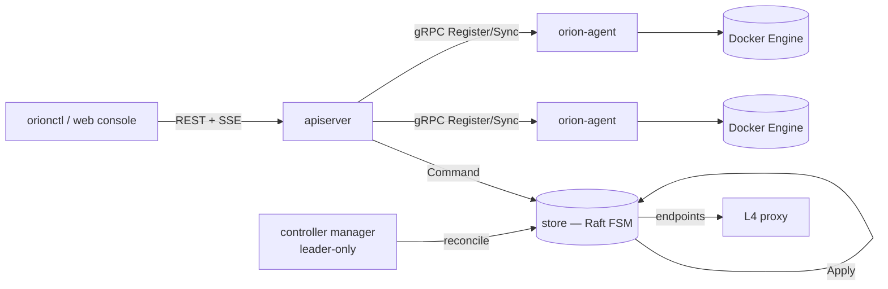

# Orion

A container orchestrator built from scratch in Go: its own Raft consensus implementation,
a resource-aware scheduler, self-healing controllers, self-fencing node agents, an L4
service proxy, and a fault-injection framework that finds its own bugs.

[](https://github.com/sujalbistaa/orion/actions/workflows/ci.yml)
[](go.mod)
[](pkg/runtime)

Kubernetes-inspired, not a clone. See [DESIGN.md](DESIGN.md#where-orion-deliberately-does-not-follow-kubernetes)
for exactly where and why it diverges.

**Live demo:** http://44.200.69.212:7070 — read-only token: `1b358c9c260cb3a48d225d2623ffbb106c5aa28d9cda4902`
(paste it into Settings). Real cluster, real containers; write access is disabled on this token.

## Quickstart

```bash
make build
make run          # single-node control plane + one local agent, real Docker
```

```bash
./bin/orionctl -server http://127.0.0.1:7070 node list
./bin/orionctl -server http://127.0.0.1:7070 workload create examples/nginx.json
./bin/orionctl -server http://127.0.0.1:7070 workload list
```

Full stack in containers — control plane, 3 agents, Prometheus:

```bash
make up
```

Web console: `make dev` (live reload) or `make web-build && make run` (production build,
served by the Go binary). Full walkthrough in [DEVELOPMENT.md](DEVELOPMENT.md).

## What it does

- **Raft from scratch** — leader election with pre-vote and CheckQuorum, log replication,
  snapshotting, read-index for linearizable reads. Verified against a deterministic seeded
  network simulator, not just live runs.
- **Explainable scheduling** — every placement decision records why it landed there, and
  why every rejected node didn't work.
- **Level-triggered self-healing** — node failure, workload crashes, and controller crashes
  all recover by reconciling against current state, with no event queue to fall behind on.
- **Self-fencing agents** — a partitioned node shuts itself down before the control plane
  could have already rescheduled its work elsewhere. Enforced at construction, not left to
  configuration.
- **Fault injection with a hypothesis** — real experiments (node failure, network partition,
  leader failure, resource exhaustion) checked continuously against 6 correctness
  invariants. [This framework found and fixed a real bug](FAILURES.md#a-bug-this-framework-found).
- **Real Docker integration** — conformance-tested against Docker 28.3.2, not simulated.
- **A REST API** — token auth, RBAC, per-principal rate limits, audit trail, live SSE
  change streaming.
- **A web console** — dense tables, real data only, no mock content anywhere.

## Architecture



One binary (`orion-server`) hosts the Raft store, REST API, and controllers. Multiple
replicas form the control plane over Raft. `orion-agent` runs one per node: pulls images,
starts containers, probes health, fences itself if it goes deaf. Full breakdown in
[ARCHITECTURE.md](ARCHITECTURE.md), the reasoning behind each decision in [DESIGN.md](DESIGN.md).

## Benchmarks

```
BenchmarkScheduleAcross100Nodes-8       77499     13943 ns/op    (~14μs / placement decision)
BenchmarkScheduleBatch1000Workloads-8     100  10530660 ns/op    ~95,000 placements/sec
live: node-failure fault injected, 3-replica deployment recovers in 9.43s
```

Real numbers from real hardware. Commands to reproduce them are in [BENCHMARKS.md](BENCHMARKS.md).

## Docs

| | |
|---|---|
| [ARCHITECTURE.md](ARCHITECTURE.md) | components, and how data flows between them |
| [DESIGN.md](DESIGN.md) | decisions, and why — including where this isn't Kubernetes |
| [API.md](API.md) | REST API reference |
| [DEVELOPMENT.md](DEVELOPMENT.md) | build it, run it, project layout |
| [TESTING.md](TESTING.md) | how 157+ tests, a Raft simulator, and fault injection fit together |
| [FAILURES.md](FAILURES.md) | every failure mode this handles, and how each is proven |
| [BENCHMARKS.md](BENCHMARKS.md) | real numbers, real hardware, real commands to reproduce |

## CLI

```bash
orionctl cluster status
orionctl node list
orionctl node describe NODE
orionctl workload create FILE
orionctl deployment create FILE
orionctl fault inject node-failure node=NODE
```

`-o json` on any read command for machine-readable output.
